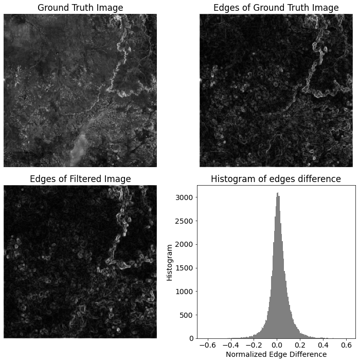
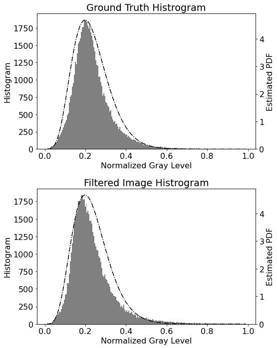

# A speckle filter for Sentinel-1 SAR Ground Range Detected data based on Residual Convolutional Neural Networks
**Authors: Alessandro Sebastianelli, Maria Pia Del Rosso, Silvia Liberata Ullo and Paolo Gamba**: 

Our residual model based on a convolutional neural network is able to remove speckle noise from GRD Sentinel-1 data.

## Results

### **Filtering results**

Qualitative results on the testing dataset: (a) Ground Truth, (b) Input with speckle, (c) Proposed Model Prediction, (d)
Lee , (e) Lee Enhanced, (f) Kuan, (g) Frost, (h) Mean, (i) Median, (j) Fastnl, (k) Bilateral, (l) SAR-BM3D

### **Edges preservation**

Top row: Input Image without speckle, edges derived
through the Sobel operator. Bottom row: edges of model
prediction made on the speckled version of the input image,
and the histogram of the differences between edges in the two
cases

### **Statistical characteristics preservation**

The figure shows the comparison between the histogram of
the filtered image against the histogram of the ground truth.
The same pdf is reported for both, and it has been calculated
by fitting the ground truth data with a Gamma distribution as
specified in 

## Dataset

The dataset is realeased in two versions:

- **dataset**: Sentinel-1 GRD 256x256 products randomly acquired on the Earth surface (averaged amplitudes)
- **dataset_v2**: Sentinel-1 GRD 256x256 products randomly acquired on the Earth surface (averaged intensities)

[Direct Download](https://github.com/Sebbyraft/sentinel_1_GRD_dataset/archive/refs/heads/main.zip)

[Dataset Repository](https://github.com/Sebbyraft/sentinel_1_GRD_dataset)

## Cite our papers

The dataset has been implemented with:

    @article{sebastianelli2021automatic,
        title={Automatic dataset builder for Machine Learning applications to satellite imagery},
        author={Sebastianelli, Alessandro and Del Rosso, Maria Pia and Ullo, Silvia Liberata},
        journal={SoftwareX},
        volume={15},
        pages={100739},
        year={2021},
        publisher={Elsevier}
    }

The speckle filter is presented in:

    @article{sebastianelli2022speckle,
        author = {Sebastianelli, Alessandro and Del Rosso, Maria Pia and Ullo, Silvia Liberata and Gamba, Paolo},
        journal = {Accepted for publication in IEEE Journal of Selected Topics in Applied Earth Observations and Remote Sensing (JSTARS)},
        title = {A speckle filter for SAR Sentinel-1 GRD data based on Residual Convolutional Neural Networks},
        year = {2022}
    }