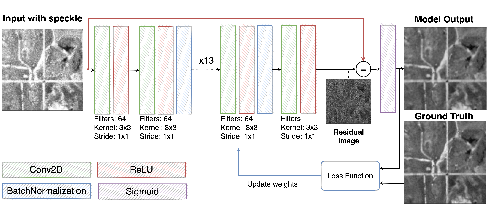

# CNNSpeckleFilter
A speckle filter for Synthetic Aperture Radar data based on Convolutional Neural Networks

**Authors**: 
- [Alessandro Sebastianelli](https://sebbyraft.github.io): sebastianelli@unisannio.it
- Maria Pia Del Rosso: mariapia.delrosso@gmail.com
- Silvia Liberata Ullo: ullo@unisannio.it

## Installation
This project has been developed in Python3.6.8.

1. <a href="https://www.python.org/downloads/release/python-368/" target="_blank">Download python 3.6.8</a>
2. <a href="https://pip.pypa.io/en/stable/installing/" target="_blank">Install PIP</a>
3. Install virtualenv: `pip3 install virtualenv`
4. Navigate to Desktop
5. Clone this project
    - A) `git clone https://github.com/Sebbyraft/CNNSpeckleFilter.git`
    - B) <a href="https://github.com/Sebbyraft/CNNSpeckleFilter/archive/refs/heads/main.zip" target="_blank">Download the project</a> and unzip it on Desktop
6. Navigate into *Desktop/CNNSpeckleFilter*
7. Create a virtual environment: `virtualenv env`
8. Activate the virtualenv *env*:
    - Windows: `env\Scripts\activate`
    - MacOS\Linux: `source env/bin/activate`
9. Install requirements: `pip install -r requirements.txt`
10. Open Jupyter Lab: `jupyter lab`

## Citation
    @inproceedings{article_id,
        title={SAR speckle filtering through Convolutional Neural Network},
        author={Sebastianelli, A. and Del Rosso, M. P. and Ullo, S. L.},
        booktitle={},
        year={2021},
        organization={}
    }